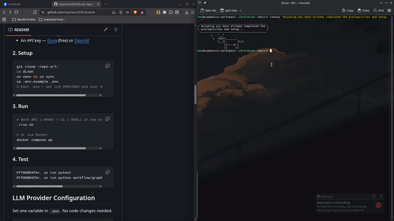
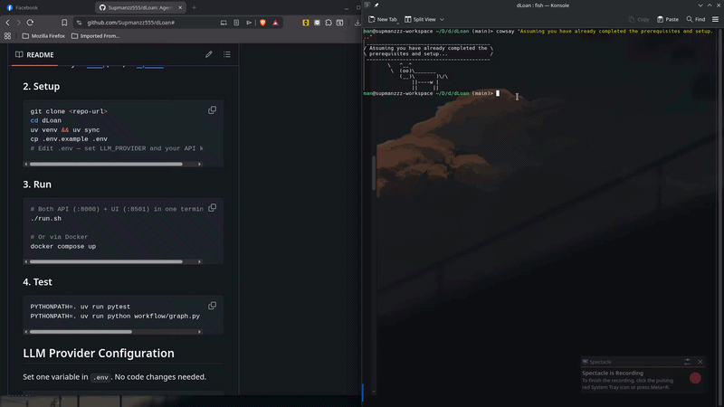

# dLoan — Agentic Loan Applicant Screening

An AI-assisted loan screening system with 6 LangGraph agents that helps credit officers evaluate loan applications. Validates completeness, checks eligibility, detects risk signals, and generates recommendations — always leaving the final decision to a human.

## Quick Links

- [Business Understanding](01-business-understanding.md) — Problem statement, user personas, workflow, eligibility rules
- [Data Design](02-data-design.md) — Input/output schema, 20 sample applicants, data dictionary
- [Agent Architecture](03-agent-architecture.md) — 6 agents, LangGraph pipeline, prompt design
- [Prototype Build](04-prototype-build.md) — API, UI, Docker, setup instructions
- [GenAI Output](05-genai-output.md) — Output schema, example results, hallucination prevention
- [Evaluation & Compliance](06-evaluation-compliance.md) — Test results, safety, limitations
- [Demo & Presentation](07-demo.md) — Demo script, architecture walkthrough

## Pipeline

```
Applicant → Intake → Document → Eligibility → Risk → Recommendation → Explanation → Officer
                                  ↕ (short-circuit: stops early if intake/doc fails)
```

Short-circuit: if intake finds missing fields or document finds missing documents, the pipeline stops immediately and returns "Need More Info" — saving 4 unnecessary LLM calls.

## Classification Outcomes

| Outcome | Meaning |
|---------|---------|
| **Proceed** | Eligible, no significant risk flags → manual review |
| **Need More Info** | Missing required fields or documents |
| **Reject / Not Eligible** | Hard rule failure (age, income, employment) |
| **High Risk Review** | Risk signals detected (DTI > 60%, bad credit, etc.) |

## Demo

| Run with Docker | Run with script |
|----------------|-----------------|
|  |  |

## Technology Stack

| Component | Technology |
|-----------|------------|
| Frontend | Streamlit (port 8501) |
| API | FastAPI (port 8000) |
| Orchestration | LangGraph |
| LLM | Groq — llama-3.3-70b-versatile (default), OpenAI — gpt-4o-mini (optional) |
| Validation | Deterministic Python rules |
| Schema | Pydantic |
| Container | Docker + docker-compose |
| Package mgmt | uv |
| Testing | pytest (real LLM integration) |
| Database | SQLite (audit log) |
